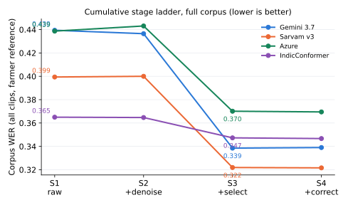
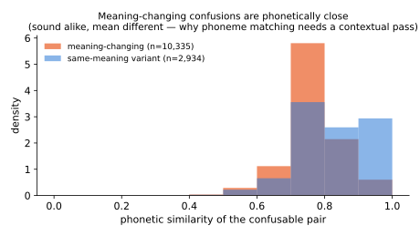
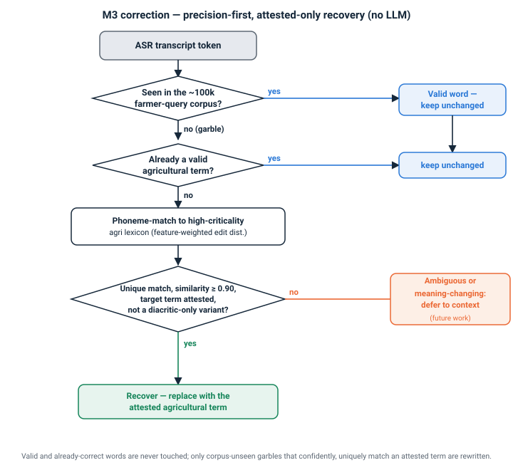
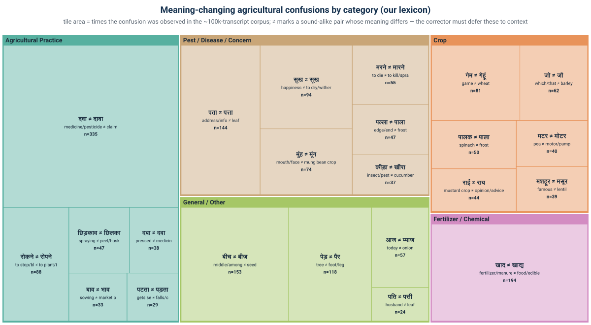

# agri-voice-pipeline

Reusable methods for a **model-agnostic, language-agnostic voice pipeline for agriculture** —
the public code companion to Digital Green's voice-pipeline paper. These are the *novel,
reusable pieces* that wrap around any off-the-shelf speech recognizer to make it work on
**noisy, multi-speaker, code-mixed Indic farmer audio** (Hindi, Telugu, Odia).

The pipeline treats the recognizer as a black box and improves the parts around it: pick the
right speaker, clean and score the text the way a farmer would, and safely recover the crop /
pest / pesticide terms that recognizers most often mishear.

> Contains **no farmer audio, transcripts, or production data** — only methods, plus the
> openly-released agricultural lexicon (mirrored from
> [DigiGreen/agri-lexicon-hindi](https://huggingface.co/datasets/DigiGreen/agri-lexicon-hindi)).



*Word-error-rate as each stage is layered on. Speaker selection is the largest single lever;
correction is tuned to be word-error-rate-safe while recovering domain terms (the value it
targets is domain-term recall, a different axis — see below).*

---

## What's here — and why it matters

Every stakeholder reads the first column; engineers read the rest.

| Component | What it gives you (plain language) | Under the hood | Code |
|---|---|---|---|
| **Phonetic engine** | Judges whether two Indian-language words *sound alike the way a recognizer confuses them* — the "ear" the rest of the pipeline listens with. | Rule-based Indic grapheme→phoneme with schwa deletion + a **feature-weighted phoneme edit distance** (not Soundex); one phoneme space designed to extend across Devanagari / Telugu / Odia. | [`phonetics/indic_phon.py`](agri_voice_pipeline/phonetics/indic_phon.py) |
| **Term recovery matcher** | Given a garbled word, finds the intended vocabulary term **by sound** — so a fragmented or mis-heard crop name can still be identified. | Phoneme-space fuzzy match over a controlled vocabulary, 1–3-token windowing for fragmented terms, and homophone-collision flagging so meaning-changing look-alikes aren't silently merged. | [`phonetics/phonetic_matcher.py`](agri_voice_pipeline/phonetics/phonetic_matcher.py) |
| **Text normalizer** | Cleans transcripts (numbers→words, punctuation, spelling variants) so two systems can be compared **fairly** and consistently across languages. | Faithful port of IISc's Hindi WER normalizer + matching Telugu / Odia pipelines with compositional Indian-numbering number-words. | [`normalization/normalize.py`](agri_voice_pipeline/normalization/normalize.py) |
| **Domain-term corrector** | Quietly fixes an **obviously mis-heard** crop / pest / pesticide name — and touches nothing it isn't almost certain about, so it won't corrupt correct words. | Precision-first, **no-LLM**, out-of-vocabulary-gated recovery: fire only on a corpus-unseen garble that *uniquely* phoneme-matches an attested high-criticality term; leave valid words and meaning-changing homophones alone. | [`correction/corrector.py`](agri_voice_pipeline/correction/corrector.py) |
| **Farmer-weighted accuracy (AWWER)** | Measures accuracy **the way it matters to a farmer** — getting the pesticide name wrong counts far more than dropping a "the". | Deterministic Agriculture-Weighted WER: every error weighted by the term's agricultural criticality (4/3/2/1), with inserted tokens charged their own criticality (symmetric with substitutions/deletions). | [`evaluation/awwer.py`](agri_voice_pipeline/evaluation/awwer.py) |
| **Speaker selection** | When several people are talking, picks out the **farmer's** voice so the assistant answers the right person. | Energy-based dominant-speaker heuristic with a duration floor; recognizer-invariant (sees only segments + audio) and carries no learned weights, so it transfers across languages. | [`selection/best_speaker.py`](agri_voice_pipeline/selection/best_speaker.py) |
| **Lexicon build recipe** | The **repeatable recipe** for the agricultural word list the system relies on — so the vocabulary can be rebuilt or extended for new crops and regions. | Seven-step build: clean → cluster by phonetic similarity → adjudicate sound-alike pairs into same-word / same-meaning / meaning-changing. | [`lexicon/build/`](lexicon/build/) |
| **Bundled lexicon** | The released agricultural vocabulary itself — categories, criticality weights, and adjudicated sound-alike pairs — so everything above runs out of the box. | 18,646 terms + 13,904 adjudicated pairs + a corpus frequency table (counts only). CC-BY-4.0. | [`data/`](data/) |

---

## Quick start

```bash
pip install -r requirements.txt      # jiwer + numpy
python examples/demo.py              # runs every module on tiny in-repo inputs (no ASR, no audio files)
```

`examples/demo.py` normalizes text in all three languages, scores a sound-alike vs a
meaning-changing pair, recovers a garbled term against the bundled lexicon, contrasts AWWER
with plain WER, and selects the louder speaker from a synthetic two-speaker clip.

Use the pieces directly:

```python
from agri_voice_pipeline.normalization import normalize
from agri_voice_pipeline.correction import AgriCorrector
from agri_voice_pipeline.evaluation import awwer
from agri_voice_pipeline.selection import select_best_speaker

normalize("2 बोरी यूरिया डालें?", "hindi")          # -> 'दो बोरी यूरिया डालें'
AgriCorrector().correct("खेत में खरपतवा बहुत हो गया है")  # खरपतवा -> खरपतवार ("weed")
awwer(refs, hyps, langs)                             # -> (awwer, wer)
select_best_speaker(segments, audio, sr)            # -> (speaker_label, sliced_audio)
```

> Installing the package elsewhere? The corrector/AWWER read the bundled lexicon from
> `data/`. If you move away from the checkout, set `AVP_DATA_DIR` to point at that folder.

---

## How the methods work

### Sound-aware phonetics
Indic ASR confuses aspirated/unaspirated, retroflex/dental, and sibilant consonants, and drops
schwas. The phonetic engine encodes each word into a phoneme string that collapses exactly those
confusions, then scores similarity with a feature-weighted edit distance. That lets the pipeline
tell a genuine mishearing (high sound-similarity) from a real difference in meaning.



### Precision-first correction
Modern recognizers are already strong, so aggressive "fixing" mostly rewrites words that were
already right. The corrector inverts that risk: it only acts on a token that is essentially
**unseen** in the corpus (a likely garble), is **not** already a valid domain term, and has a
**unique** phonetic match to an attested, high-criticality agricultural word. Everything else
passes through untouched — including meaning-changing look-alikes, which need sentence context.



### An agricultural word list with meaning-aware pairs
The lexicon isn't just a term list — sound-alike pairs are adjudicated into *same word*,
*same meaning*, and *meaning-changing*, so the corrector knows which confusions are safe to
normalize and which would change what the farmer said.



---

## Not included (by design)

- **No farmer audio, transcripts, or the evaluation corpus** (privacy). The evaluation set is
  released separately as
  [DigiGreen/agri-voice-eval](https://huggingface.co/datasets/DigiGreen/agri-voice-eval).
- **No API keys, provider credentials, or internal paths.**
- The full experiment/pipeline runner and per-recognizer result files live in the project's
  working repository; this repo is the reusable methods only.

## Related open-source releases

- Fine-tuned diarization segmenter — [DigiGreen/pyannote-segmentation-agri-indic](https://huggingface.co/DigiGreen/pyannote-segmentation-agri-indic)
- Agricultural lexicon — [DigiGreen/agri-lexicon-hindi](https://huggingface.co/datasets/DigiGreen/agri-lexicon-hindi)
- Evaluation set — [DigiGreen/agri-voice-eval](https://huggingface.co/datasets/DigiGreen/agri-voice-eval)
- Interactive demo — [DigiGreen/farmerchat-voice-pipeline-demo](https://huggingface.co/spaces/DigiGreen/farmerchat-voice-pipeline-demo)

## License & citation

Code is **MIT**. The bundled lexicon (`data/`) is **CC-BY-4.0**, © 2026 Digital Green — see
[`data/README.md`](data/README.md). If you use this work, please cite Digital Green's
agricultural voice-pipeline paper and the datasets above.

Phonetic edit-distance-with-cost builds on Kondrak (NAACL 2000) and Zobel & Dart (SIGIR 1996);
the Hindi normalizer is ported from IISc's reference WER tooling (credited in the source).
